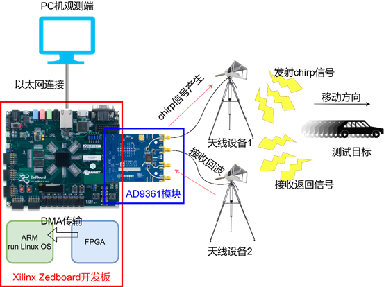

# Zedboard_AD9361_radar

## 1 硬件平台设计与开发

本测试基于ZYNQ模块化设计，主要设计开发流程采用Xilinx Zedbroad开发板和AD9361射频模块联合进行通感一体信号的收发与数据处理工作，硬件系统构建如图1所示，其中Zedbroad开发板主要进行ARM处理系统（Processing System，PS）和FPGA可编程逻辑（Programmable Logic，PL）的开发工作，AD9361射频模块主要完成射频信号的收发及Zedbroad间的通信工作，Zedboard与AD9361模块以FMC接口相连接。

    

AD9361的输出与输入通道各自接入喇叭天线，通过硬件实现chirp信号收发与PL数字信号处理，天线设备1向测试目标方向发射chirp信号，天线设备2接收返回信号；后续将处理后的结果通过DMA数据传输到PS端Linux操作系统开发，最后将输出信号以以太网接口形式传输到PC机端进行结果的观测。

基于Vivado开发PL部分程序，采用了模块化程序设计，让开发具有稳定性、便捷性与可维护性，PL程序主要包含的部分有AD9361射频模块的初始化配置通信模块、chirp信号数字信号处理模块、PL与PS数据交互接口模块、ZYNQ PS配置模块、ILA仿真窗口观测模块、PLL锁相环模块，具体Vivado模块化设计图如图2所示。

### 1.1 Xilinx Zedboard开发板

Zedboard是第一款面向开源社区的Zynq-7000系列开发板，而Zynq-7000系列FPGA，也称为完全可编程（All Programable）SoC，是Xilinx一个有重大意义的产品系列，Zedboard外观图如图3所示。

Zedboard开发板可分为PL(Programmable Logic)与PS(Processing System)两个部分，其中PL部分采用Vivado进行开发，用户可以通过Verilog/VHDL对程序进行模块化编写，经过RTL例化后可以导入到Block Design中与Xilinx库中的IP核进行联合开发，除此之外，Vivado可进行PS部分资源的调度分配；SDK作为PS核的C/C++程序开发工具，配合Vivado可以进行ZYNQ程序的配合联调；ZYNQ的PS部分采用了高端ARM核架构，支持操作系统的开发，通过Petalinux的配置可以对Linux系统进行定制的裁剪，通过HDF文件创建Petalinux工程后，对特定外设进行设备树的编写与配置、驱动的更新与安装、应用程序的调试与开发，即可让PS在高端的操作系统环境下更加方便的执行任务，此时的SDK可以作为应用程序的协作调试开发工具，具体Zedboard开发细节如图4所示。

PL与PS系列的开发，足以承担与AD9361射频模块的高速数据传输与处理任务。采用适当的方式利用ZYNQ芯片的PL部分进行并行加速，并结合PS部分的逻辑开发，可以有效地实现内部资源的合理调度，从而提高系统的性能和效率。在程序开发方面，相比于传统的纯FPGA开发，更具有稳定性和可维护性，并且在实时性和延迟方面有优越的性能，数据传输和处理的准确性和效率也有高效的提升。

### 1.2 AD9361模块

AD9361是一款由ADI公司提供的高性能、高度集成射频（RF）敏捷收发器，专为3G和4G基站应用而设计。其可编程性和宽带能力使其成为广泛收发器应用的理想选择。该器件将射频前端与灵活的混合信号基带部分和集成频率合成器相结合，通过向处理器提供可配置的数字接口来简化设计。AD9361接收器LO工作频率为70 MHz至6.0 GHz，发射机LO工作频率为47 MHz至6.0 GHz，覆盖大多数许可和非许可频段。支持小于200 kHz至56 MHz的信道带宽。本项目采样AD9361作为射频模块进行信号的收发以及处理工作。

两个独立的直接转换接收器具有最先进的噪声系数和线性度。每个接收（RX）子系统都包括独立的自动增益控制（AGC）、直流偏移校正、正交校正和数字滤波，从而消除了数字基带中对这些功能的需求。AD9361还具有灵活的手动增益模式，可以外部控制。每个通道两个高动态范围模数转换器（ADC）将接收到的I和Q信号数字化，并通过可配置的抽取滤波器和128抽头有限脉冲响应（FIR）滤波器，以适当的采样率产生12位输出信号。

图5显示的是AD-FMCOMMS2-EBZ板卡，是AD9361的FMC板，ADI官方提供ZC702、ZC706与zedboard的开发例程，高效且快捷的进行开发。通过FMC连接口可以快速的进行数据的传输，确保数据的实时性，板载具有集成12位DAC和ADC的RF 2×2收发器。

### 1.3 chirp信号硬件实现

chirp信号由MATLAB R2022a产生，长度为1024点，信号频率随时间从0到1线性变化，并且对信号进行固定16位位宽，并且对每位数据进行四舍五入取整，方便后续更好的传输与存储，chirp信号时域图如图6所示，蓝色为信号实部，红色为信号虚部，信号频率随时间变化图如图7所示。

利用chirp信号进行测距测速，具体其测距示意图如下图8所示。图中蓝色实线是发出的信号频率，红色虚线是接受到的信号频率，为扫频周期的一半，为扫频带宽，为从信号发射到接受所经历的时间。

Vivado程序中，单路chirp信号进行混频操作具体步骤如下，在sub_top模块中，对实时接收信号adc_data_i1/q1变为有符号数形式adc_data_i1/q1_div输出，dac_data_i1/q1发射信号变为有符号数后取共轭之后得到dac_data_i1/q1_div形式进行输出。

将有符号数adc_data_i1/q1_div[11:0]、dac_data_i1/q1_div[11:0]输出之后，两路数据通过IP核Concat进行复数乘法预准备，将每个数据数据位数变为16位，且以虚部在高位实部在低位的形式，以AXIS总线形式传输给复数乘法器IP核Complex Multiplier，接着将AXIS总线形式的输出64位数据由分割模块Slice IP核将计算结果的实部与虚部信号传输出来，具体程序模块图如图9所示。

从混频理论上分析，可知混频得到的结果中，其频率分量是测距需要关心的结果，那么接下来需要将混频得到的信号进行FFT处理，Vivado中通过调用FFT IP核实现该操作，首先对Vivado FFT IP进行配置，如图10所示，使用通道数为1，FFT点数为1024，采用Radix-4，Burst I/O结构模式，这样可以最有效的利用PL部分DSP资源，让FFT计算响应速度更快，经过配置计算，得出FFT计算延迟时间为13.672us。

由于FFT计算有延时，而我们的需求是要持续的计算混频信号每1024点的FFT结果，所以我们采用了流水线的形式，例化4个FFT IP核进行无间断的计算，依次对FFT输入1024点数据，之后依次从FFT中输出1024点结果，通过ILA观测窗口可以获取实时信号，如图11所示，第一行与第二行信号分别代表实时接收信号的实部与虚部，第三行与第四行信号分别代表实时发送信号的实部与虚部，第5行数据结构中，展开的前四行是分别输入给四个FFT IP的数据有效标志，即每个传输的长度是1024点，首尾相连依次延拓，展开的后四行分别是FFT IP输出有效标志位，每个输出长度是1024点，依然是首尾相连依次输出，图中最后两行是FFT输出结果，通过理论分析，混频后的结果是一个正弦函数，其频谱为一个冲击函数，对比Vivado ILA观测窗口得以验证，FFT计算结果正确。

1.4 DMA数据传输

ZYNQ的DMA（Direct Memory Access）控制器是一种用于Xilinx Zynq系列芯片的技术，其允许系统内存与外部设备之间直接、高速地传输数据，无需CPU的干预。DMA的主要作用包括加速数据传输、减轻CPU负担、提高系统效率以及支持大数据流处理，使得Zynq系统能够更有效地利用硬件资源，提高整体性能和应对各种应用场景的能力。

本项目采用DMA可以实现PL与PS之间数据流的交互，让需要消耗DSP的工作交给PL部分做，让需要展示和简单逻辑开发的工作给PS做。PL与PS通过使用DMA对DDR内存进行写和读操作，实现了数据的交互，具体Vivado程序模块实现，使用了AXI DMA IP核，在不使用Micro DMA的情况下，使能读与写通道，并且写通道设置数据宽度为64，读通道设置数据宽度为32，具体IP核配置页面如图12所示。

Vivado程序模块如图13所示，其中S_AXIS_S2MM与S_AXIS_MM2S是AXIS总线接口，对于PL部分程序，分别对应写和读两种操作，AXIS接口协议以从接口为例，重要端口有以下：s_axis_s2mm_tdata是需要写入的数据，s_axis_s2mm_tlast是最后一组数据传输时刻置高，代表输入完毕，s_axis_s2mm_tready是接收方给发送方提供的准备完毕信号，s_axis_s2mm_tvalid是信号传输有效标志。s2mm_introut和mm2s_introut分别为写和读一包数据传输完成时，产生的中断信号，将其接入PS核中为后续的程序提供中断。

DMA IP核需要与PS核时钟保持一致，所以PL与PS之间的交互需要用到FIFO模块进行时钟的转换，Vivado中使用FIFO IP核进行配置，设置FIFO深度为8192，将时钟配置为独立模式，即输入与输出的AXIS总线时钟分开，分别接入PL与PS的时钟即可，配置选项中的CDC sync stages同步阶数需要设置较高，这样才能让两个时钟间进行更好的同步，具体配置页面如图14所示。

由于PS读DDR速度有限，并且存储数据内容深度有限，再者高速的chirp信号传输只能测极高速度的物体，不适合本项目场景，所以PL对DDR进行写操作时需要以均匀抽帧形式发送，这样后续才能测到持续时间长速度低的目标。

### 1.5 Petalinux操作系统开发

Zedboard的PS部分可以安装Linux操作系统，借助Petalinux进行定制和裁剪，可以在嵌入式Linux系统中轻松地调用外设。通过Linux开发环境，可以利用多线程的方式更有效地管理系统资源和执行任务。使用Petalinux进行定制Linux系统，以最大程度地优化性能和资源利用率，通过裁剪，可以移除不必要的组件和功能，从而减小系统的体积并提高启动速度。同时，定制化的Linux系统还可以更好地适配你的应用程序和外设，确保系统的稳定性和可靠性。在这样的开发环境下，利用多线程编程可以使系统更高效地处理并发任务，通过多线程，可以将不同的任务并行执行，充分利用处理器的多核性能，从而提升系统的响应速度和整体性能。这对于实时性要求较高的应用场景尤为重要，如数据处理、通信控制等。

Petalinux创建工程之后，需要加载Vivado导出的HDF文件，之后要对Petalinux进行配置操作，输入petalinux-config命令，得到配置界面如图15所示。

PetaLinux的主要三种配置包括：硬件配置：这个配置阶段涉及对硬件平台的描述和设置。这包括定义处理器架构、外设配置、中断控制器、存储器等。通过硬件配置，可以将PetaLinux与特定的硬件平台相匹配，确保Linux系统能够正确地与硬件交互；软件配置：在软件配置阶段，开发者可以选择要包含在Linux系统中的软件包和功能。这包括选择核心组件（如内核版本）、文件系统类型（如ramdisk、jffs2等）、以及用户空间工具和应用程序。软件配置的目的是根据项目需求定制Linux系统，使其具备所需的功能和性能；系统配置：系统配置阶段涉及到系统整体的设置和优化。这包括配置网络、文件系统布局、启动顺序等。通过系统配置，可以对Linux系统进行最终的调整和优化，以确保其能够在目标硬件上正常运行并满足应用程序的要求。

在Linux系统中进行应用程序的开发，首先需要对用户设备树进行编写，由于我们重点需要DMA外设资源，所以对DMA进行设备树的编写，具体配置如下所示。

    /include/ "system-conf.dtsi"  
    / {  
        model = "Zynq Zed Development Board";  
        compatible = "xlnx,zynq-zed", "xlnx,zynq-7000";  
        axidma_chrdev: axidma_chrdev@0 {  
            compatible = "xlnx,axidma-chrdev";  
            dmas = <&axi_dma_0 0 &axi_dma_0 1>;  
            dma-names = "tx_channel","rx_channel";  
        };  
    };
    &amba_pl{  
        dma_proxy:dma_proxy@0 {  
            compatible = "xlnx,dma_proxy";  
            dmas =<&axi_dma_0 0 &axi_dma_0 1>;  
            dma-names ="dma_proxy_tx","dma_proxy_rx";  
        };  
    };  
    &axi_dma_0{  
        dma-channel@40400000 {  
            xlnx,device-id = <0x0>;  
        };  
        dma-channel@40400030 {  
            xlnx,device-id = <0x1>;  
        };  
    };  

硬件模型（Hardware Model）被定义为 "Zynq Zed Development Board"，并且与Xilinx Zynq Zed开发板兼容；描述了一个名为 "axidma_chrdev" 的字符设备节点，具有AXI DMA外设的字符设备；AXI DMA外设的两个DMA通道被定义为 "tx_channel" 和 "rx_channel"，分别用于传输数据的发送和接收；在AMBA总线中描述了一个名为 "dma_proxy" 的DMA代理设备，其内部使用AXI DMA外设进行数据传输；AXI DMA外设的两个DMA通道分别在地址0x40400000和0x40400030处定义，并且各自被分配了一个设备ID。

对DMA驱动进行安装，让DMA外设资源加载在Linux系统文件的/dev目录下，编写完驱动后，输入加载命令对其进行加载，如图16所示，除此之外，DMA发送与接收中断也在/proc/interrupts中有加载，其中断编号分别为61与62，如图17所示。

在DMA驱动编写完成且加载之后，开始对DMA的应用程序进行开发，与SDK开发相似，首先对相关外设进行初始化操作，进入循环中不断的DMA接收数据，并且向上位机进行以太网数据传输，具体细节流程图如图18所示。

在接收的同时，本项目也希望对AD9361发射的内容进行快速调整，所以使用DMA对PL进行写操作，让容易改动数据的PS端发送改动数据给PL端进行发送，方便后续的调试与开发，具体操作是在相关外设初始化后，阻塞式等待上位机以太网数据的传输，之后DMA发送数据给PL，PL程序再对更新的数据进行加载，具体细节流程图如图19所示。

在上位机端，使用Python对接收的数据进行最后的处理与展现，具体处理算法如下所示：

    if(num_pack_128 == 128):  
        num_pack_128 = 0  
        # 傅里叶变换  
        img = np.fft.fftshift(np.fft.fft(dd, axis=0), axes=0)  
        img2 = np.fft.ifft(np.fft.fft(img, axis=0), axis=0, n=1280)  
        img2 = np.fft.ifft(np.fft.fft(img2.T, axis=0), axis=0, n=10240).T  
        # 构建坐标  
        y = np.arange(-639, 641) * (40e6 / 60 / 1024 / 128 * 0.15) / 10  
        x = np.arange(1, 10241)  
        plt.clf()  
        plt.imshow(np.abs(img2), aspect='auto', extent=[x[0], x[-1], y[0], y[-1]])  
        plt.colorbar()  
        plt.ylabel('Velocity [m/s]')  
        plt.show(block=False)  
        plt.pause(0.05)     #暂停秒数，延长显示时间

首先对128,1024的数据包的第一个维度进行FFT计算，很容易得到测试目标的速度信息，接下来对128,1024的数据包进行均匀插值填充，让其分辨率提高10倍，得到1280,10240的数据包，接下来使用matplotlib库对二维数据进行绘制，即可得到多普勒-时延图，即显示速度-距离分量图如图20所示，横轴代表了距离分量，纵轴代表了速度分量。

### 1.6 硬件平台展示

如图21展示的是Zedboard+AD9361设备实物，在场外测试环境下，我们采用了喇叭天线连接到AD9361模块的收发端口，喇叭天线如图22所示。

测试内容

本次实验旨在多个测试设备对目标进行定位，通过各个节点对目标进行测距，将各节点测距数据融合到总节点上，总节点对各节点数据进行综合分析。实验采用三个中心广播信号发射源，分别分布在一个等边三角形的三个顶点上。

在实验设置中，三个中心广播信号源部署于一个等边三角形的三个顶点，每个信号源独立地发射特定频率的chirp信号。chirp信号作为一种频率随时间变化的信号，具有频率线性调变的特点，在无线通信和雷达探测中表现出卓越的性能。每个信号源发射的chirp信号的频率是不同的，接收器在接收到反射信号后，能够区分这些信号是特定的信号源所产生，增强系统的容错性和鲁棒性。

通过发射这些chirp信号，信号源能够探测到在其覆盖范围内的目标。当目标进入信号覆盖区域时，会反射这些信号，信号源接收到这些反射信号后，将进行信号处理，以确定目标的距离信息。

在该区域范围内，测试目标按照预定轨迹移动，同时，三个中心广播通过接收返回的信号，进行算法处理，得到测试目标离该中心广播的距离。

通过三个节点的测距信息，在二维空间中，以三个已知中心广播点的位置为圆心，分别以节点测距信息为半径，可以发现三个圆会两两相交，三个交点组成的三角形中，设定该三角形的重心为测试定位点，即实现多测试设备对目标进行定位。

